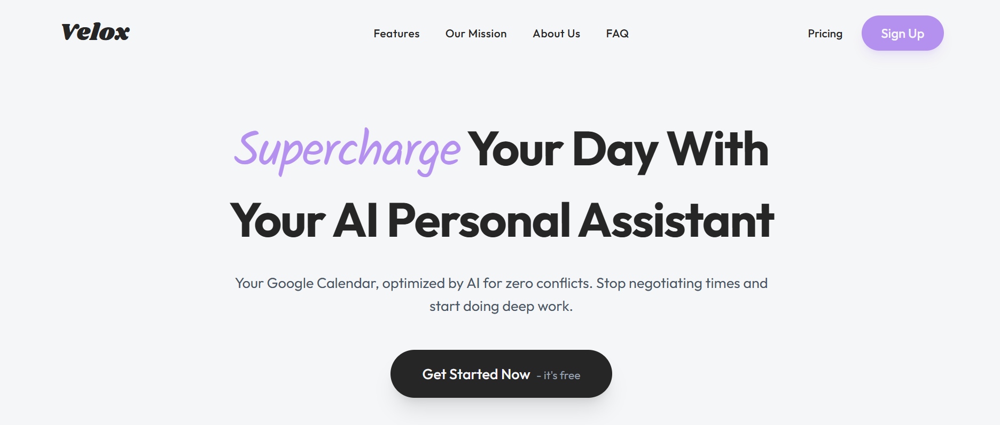

# Velox ⏳



[](https://velox-ai-psi.vercel.app)
[](./LICENSE)

**Velox** is an intelligent scheduling assistant that turns natural language into structured calendar events. Instead of clicking through date pickers and time slots, simply type *"Meeting with John next Tuesday at 2pm for 30 mins"* and let the AI handle the rest.

---

## ✨ Key Features

- **🗣️ Natural Language Parsing:** Type plans like you're texting a friend; the AI extracts date, time, duration, and participants.
- **📅 Smart Integration:** Seamlessly syncs events to **Google Calendar** (or your platform of choice).
- **⚡ Conflict Detection:** Automatically checks for overlapping events before scheduling.
- **🛡️ Secure Auth:** User sessions managed via **Better Auth (Auth.js v5)**.
- **🌍 Timezone Aware:** Intelligent handling of cross-border scheduling.

---

## 🛠️ Tech Stack

- **Framework:** [Next.js 15](https://nextjs.org/) (App Router)
- **AI/LLM:** [OpenAI API](https://openai.com/) / [Vercel AI SDK](https://sdk.vercel.ai/)
- **Database:** MongoDB & Prisma
- **Styling:** Tailwind CSS & Shadcn/ui
- **Calendar:** React Big Calendar / FullCalendar
- **Auth:** Auth.js (v5)

---

## 🚀 Getting Started

Follow these steps to run the scheduler locally.

### Prerequisites

- Node.js (v18+)
- MongoDB URI
- OpenAI (or other LLM) API Key
- Google Cloud Console Credentials (if using GCal sync)

### Installation

1. **Clone the repository**
   ```bash
   git clone [https://github.com/TheGrandGeiss/your-repo-name.git](https://github.com/TheGrandGeiss/your-repo-name.git)
   cd your-repo-name
Install dependenciesBashnpm install
Set up Environment VariablesCreate a .env file in the root:Code snippet# Database
DATABASE_URL="mongodb+srv://..."

# Auth
AUTH_SECRET="your_secret_here"

# AI Provider
OPENAI_API_KEY="sk-..."

# Calendar Integration (Optional)
GOOGLE_CLIENT_ID="..."
GOOGLE_CLIENT_SECRET="..."
Run Database PushBashnpx prisma generate
npx prisma db push
Start the AppBashnpm run dev
📸 UsageNatural Language InputGenerated Event"Lunch with Sarah tomorrow at noon"Title: Lunch with SarahTime: Tomorrow, 12:00 PM - 1:00 PM🤝 ContributingWe welcome contributions! Please see CONTRIBUTING.md for details on how to submit pull requests.📬 ContactEbenebe Emmanuel Chidera GitHub: @TheGrandGeiss